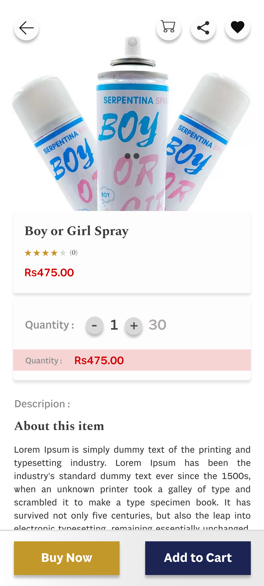

# Yevobay

Welcome to **Yevobay**, an eCommerce mobile application designed to provide a seamless shopping experience.

## Tech Stack

- **Frontend:** Flutter
- **Backend:** Laravel API

## Features

- User-friendly interface
- Secure payment gateway
- Real-time order tracking
- Product reviews and ratings

## Screenshots

<table>
  <tr>
    <td></td>
    <td></td>
  </tr>
  <tr>
    <td></td>
    <td></td>
  </tr>
  <tr>
    <td></td>
    <td></td>
  </tr>
  
</table>

## IMPORTANT

This repo does not contain any code implementations for privacy reasons.

## Contributing

Contributions are welcome! Please contact me for more information .

## License

This project is licensed under the MIT License.
